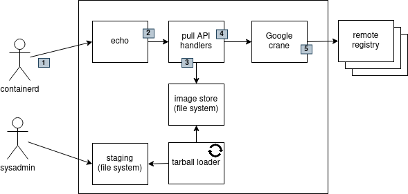

# EXPERIMENTAL Pull-only Pull-through Caching OCI Distribution Server

This project is a **pull-only**, **pull-through**, **caching** OCI Distribution server. That means:

1. It exclusively provides _pull_ capability. You can't push images to it, it doesn't support the `/v2/_catalog` endpoint, etc.
2. It provides *caching pull-through* capability to any upstream registry: internal, air-gapped, or public; supporting the following types of access: anonymous, basic auth, HTTP, HTTPS, one-way TLS, and mTLS.

> This is a POC. As such it is very rough. I'll be cleaning it up over time. (See the TODO file)

This distribution server is intended to satisfy **one** use case: the need for an in-cluster Kubernetes caching pull-through registry that enables the k8s cluster to run reliably in a network context with no-, intermittent-, or low latency connectivity to upstream registries - or - an environment where the upstream registries serving the k8s cluster have less than 5 nines availability.

As a secondary capability the server can be loaded from image tarballs. This supports a scenario where the registry is loaded in one location, disconnected, transported, and then runs air-gapped at its remote home.

The goals of the project are:

1. Implement one use case
2. Be simple

To achieve this - the server simply uses the file system as the sum total of it's knowledge about the image cache. The belief is - this approach should result in high reliability: the registry should be able to sustain normal k8s disruptions like pod evictions of the registry container as long as the underlying persistent storage for the image cache is reliable.

## Design



The basic usage scenario is:

1. A client (containerd, for example) pulls an image. The embedded [Echo](https://echo.labstack.com/) server handles the API calls.
2. The Echo server delegates to the OCI Registry API handlers to implement the OCI Registry server logic.
3. If the image is already cached on the file system it is provided to the caller.
4. Otherwise, the API handlers delegate to the embedded [Google Crane](https://github.com/google/go-containerregistry/blob/main/cmd/crane/README.md) code. To support this, containerd appends a query parameter indicating the requested namespace to all API calls. (More on this below.)
5. The Google Crane code builds the upstream registry URL using the namespace value and pulls the image from the upstream as a tarball, returning it to the handler which unpacks it and saves it to the image store.
6. Independently, a tarball loader runs as a goroutine watching a staging directory on the file system. Whenever a tarball appears there it is unpacked and moved to the image store, and then the tarball is deleted. This supports initial and incremental manual population of the image cache.

## API Implementation

The OCI Distribution API is built by first creating an Open API spec using Swagger. See `ociregistry.yaml` in the project root. Then the [oapi-codegen](https://github.com/deepmap/oapi-codegen) tool is used to generate the API and models using configuration in the `api` directory. This approach was modeled after the OAPI-Codegen [Petstore](https://github.com/deepmap/oapi-codegen/tree/master/examples/petstore-expanded/echo) example.

The key components of the API scaffolding supported by OAPI-Codegen are shown below:

```shell
​```
├── api
│   ├── models
│   │   └──models.gen.go (generated)
│   ├── models.cfg.yaml (modeled from pet store)
│   ├── ociregistry.gen.go (generated)
│   └── server.cfg.yaml (modeled from pet store)
├── cmd
│   └── ociregistry.go (this is the server - which embeds the Echo server)
└── ociregistry.yaml (the openapi spec built with swagger)
​```
```

## Configuring `containerd`

The following snippet shows how to configure `containerd` to mirror **all** image pulls to the pull-through registry:

Add a `config_path` entry to `/etc/containerd/config.toml` to tell `containerd` to load all registry mirror configurations from that directory:

```shell
   ...
   [plugins."io.containerd.grpc.v1.cri".registry]
      config_path = "/etc/containerd/certs.d"
   ...
```

Then create a configuration directory and file that will tell containerd to pull from the caching pull-through registry server. This is an example for `_default_` which indicates that **all** images should be mirrored. The file is `/etc/containerd/certs.d/_default/hosts.toml`. In this hypothetical example, the caching pull-through registry server is running on `192.168.0.49:8080`:

```shell
[host."http://192.168.0.49:8080"]
  capabilities = ["pull", "resolve"]
  skip_verify = true
```

The _resolve_ capability tells containerd that a HEAD request to the server with a manifest will return a manifest digest. The _pull_ capability indicates to containerd that the image can be pulled.

## Configuring the OCI Registry Server

The OCI Registry server may need configuration information to connect to upstream registries. By default, it will attempt anonymous plain HTTP access. Many OCI Distribution servers will reject HTTP and fail over to HTTPS. Then you're in the realm of TLS and PKI. Some servers require auth as well. To address all of these concerns the OCI Registry server accepts an optional command line parameter `--config-path` which identifies a configuration file in the following format:

```
- name: upstream one
  description: foo
  auth: {}
  tls: {}
- name: upstream two
  description: bar
  auth: {}
  tls: {}
- etc...
```

The configuration file is a yaml list of upstream registry entries. Each entry supports the following configuration structure:

```
- name: my-upstream (or my-upstream:PORT)
  description: Something that makes sense to you (or omit it - its optional)
  auth:
    user: theuser
    password: thepass
  tls:
    ca: /my/ca.crt
    cert: /my/client.cert
    key: /my/client.key
    insecure_skip_verify: true/false
```

The `auth` section implements basic auth, just like your `~/.docker/config.json` file.

The `tls` section can implement multiple scenarios:

1. One-way insecure TLS, in which client certs are not provided to the remote, and the remote server cert is not validated:

   ```
   tls:
     insecure_skip_verify: true
   ```

2. One-way **secure** TLS, in which client certs are not provided to the remote, and the remote server cert **is** validated using the OS trust store:

   ```
   tls:
     insecure_skip_verify: false (or simply omit since it defaults to false)
   ```

3. One-way **secure** TLS, in which client certs are not provided to the remote, and the remote server cert is validate using a **provided** CA cert:

   ```
   tls:
     ca: /my/ca.crt
   ```

4. mTLS (client certs are provided to the remote):

   ```
   tls:
     cert: /my/client.cert
     key: /my/client.key
   ```
mTLS can be implemented **with** and **without** remote server cert validation as described above in the various one-way TLS scenarios. Examples:

   ```
   - name foo.bar.1.io
     description: mTLS, don't verify server cert
     tls:
       cert: /my/client.cert
       key: /my/client.key
       insecure_skip_verify: true
   - name foo.bar.2.io
     description: mTLS, verify server cert from OS trust store
     tls:
       cert: /my/client.cert
       key: /my/client.key
       insecure_skip_verify: false
   - name foo.bar.3.io
     description: mTLS, verify server cert from provided CA
     tls:
       cert: /my/client.cert
       key: /my/client.key
       ca: /remote/ca.crt
       insecure_skip_verify: false
   ```

## Command line options

The following options are supported:

| Option        | Default              | Meaning                                                      |
| ------------- | -------------------- | ------------------------------------------------------------ |
| --log-level   | error                | Valid values: debug, info, warn, error                       |
| --image-path  | /var/lib/ociregistry | The root directory of the image store                        |
| --config-path | Empty                | Path a file providing remote registry auth and TLS config. If empty then every upstream will be tried with anonymous HTTP access failing over to HTTPS using the OS Trust store to validate the remote registry. |
| --port        | 8080                 | Server port. E.g. `crane pull localhost:8080 foo.tar`        |

