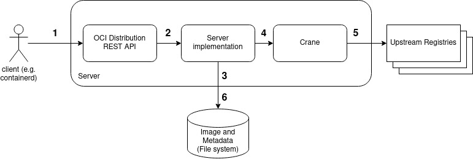
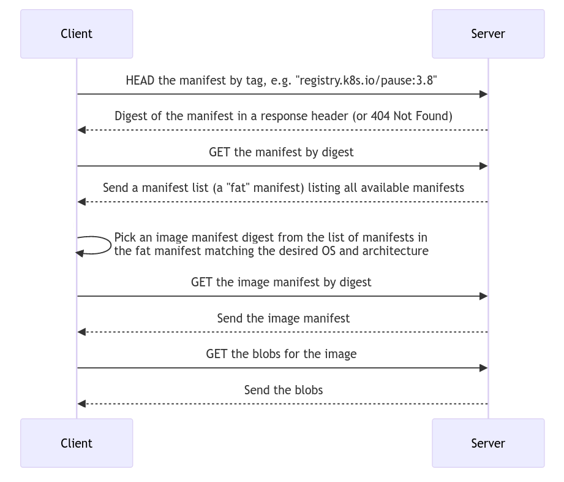

[](https://github.com/aceeric/ociregistry/actions/workflows/unit-test.yml)
[](https://goreportcard.com/report/github.com/aceeric/ociregistry)
[](https://github.com/aceeric/ociregistry/actions/workflows/vulncheck.yml)
[](https://artifacthub.io/packages/search?repo=ociregistry)

_Ociregistry_ is a **pull-only**, **pull-through**, **caching** OCI Distribution server. That means:

1. It exclusively provides _pull_ capability. You can't push images to it, it doesn't support the `/v2/_catalog` endpoint, etc. (Though you can pre-load it. More on that below.)
2. It provides *caching pull-through* capability to any upstream registry: internal, air-gapped, or public; supporting the following types of access: anonymous, basic auth, HTTP, HTTPS, one-way TLS, and mTLS.

This OCI distribution server is intended to satisfy one use case: the need for a Kubernetes caching pull-through registry that enables a k8s cluster to run reliably in disrupted, disconnected, intermittent and low-bandwidth (DDIL) edge environments. (However, it also nicely mitigates rate-limiting issues when doing local Kubernetes development.)

The goals of the project are:

1. Implement one use case
2. Be simple and reliable

----

**Table of Contents**

- [1.8.0 CHANGES APRIL 2025](#180-changes-april-2025)
- [Quick Start - Desktop](#quick-start---desktop)
- [Quick Start - Kubernetes](#quick-start---kubernetes)
- [Configuring containerd](#configuring-containerd)
- [Configuring the Server](#configuring-the-server)
- [Command Line Options](#command-line-options)
- [Pre-Loading the Server](#pre-loading-the-server)
- [Image Store](#image-store)
- [Pruning the cache](#pruning-the-cache)
- [Design](#design)
- [Image Pull Sequence Diagram](#image-pull-sequence-diagram)
- [Code Structure](#code-structure)
- [REST API Implementation](#rest-api-implementation)
- [Kubernetes Considerations](#kubernetes-considerations)
- [Administrative REST API](#administrative-rest-api)

## 1.8.0 Changes April 2025

> **If you are not upgrading from a version prior to 1.8.0, skip this section.**

Version 1.8.0 implements substantial changes from the prior release. The changes are:

1. Implemented a CLI using [urfave/cli](https://github.com/urfave/cli), so the command line structure is completely new.
2. The server supports background cache pruning (while the server is running) and improves command line pruning of the file system (when the server isn't running).
3. Replaced the Google Crane library with my own [Image Puller](https://github.com/aceeric/imgpull) library for pulling images from the upstream registries.
4. Added the ability to supply full configuration from a config file (`--config-file`), the command line, or both.
5. Added the `--air-gapped` flag so that in the air gap the server does not reach out to the upstream if an image is requested but not cached.
6. Added a lean administrative REST API to get information about the in-memory cache, and perform ad-hoc pruning against the running server. Only accessible via `curl` for now.

**Important about pruning:**

In order to support prune by create date and accessed date, the structure of the manifests on the file system had to change. Two new fields were added: `created` and `pulled`. The new server can directly read prior versions' manifests as-is. On every pull the server updates the `pulled` field to support prune by recency of access. But the server _won't_ update the `created` field. (The `created` field is only set on initial pull.) Before running the new server you must hand-patch the old manifests if you want to use pruning.

Example:
```shell
CREATED="2025-04-01T22:07:01"
PULLED="2025-04-01T22:07:01"
sed  -i -e 's/}}$/},"created":"$CREATED","pulled":"$PULLED"}/'\
  /var/lib/ociregistry/img/* /var/lib/ociregistry/fat/*
```

This works because the old manifests ended with two closing curly braces at the very end of the file.

## Quick Start - Desktop

After git cloning the project:

### Build the Server
```shell
make server
```

This command compiles the server and creates a binary called `ociregistry` in the `bin` directory relative to the project root.

### Run the Server

You provide an image storage location with the `--image-path` arg. If the directory doesn't exist the server will create it. The default is `/var/lib/ociregistry` but to kick the tires it makes more sense to use the system temp directory. By default the server listens on `8080`. If you have something running that is already bound to that port, specify `--port`. We'll specify it explicitly here with the default value:

```shell
bin/ociregistry --image-path /tmp/images serve --port 8080
```

### Result
```shell
----------------------------------------------------------------------
OCI Registry: pull-only, pull-through, caching OCI Distribution Server
Version: Z.Z.Z, build date: 2025-04-21T00:05:54.37Z
Started: 2025-04-20 20:06:04.6693839 -0400 EDT (port 8080)
Running as (uid:gid) 1000:1000
Process id: 27010
Tls: none
Command line: bin/ociregistry --image-path /tmp/images serve --port 8080
----------------------------------------------------------------------
```

### In Another Terminal

Curl a manifest list. Note the `ns` query parameter in the URL below which tells the server to go to that upstream if the image isn't already locally cached. This is exactly how containerd does it when you configure it to mirror:

```shell
curl localhost:8080/v2/kube-scheduler/manifests/v1.29.1?ns=registry.k8s.io | jq
```

### Result
```json
  "schemaVersion": 2,
  "mediaType": "application/vnd.docker.distribution.manifest.list.v2+json",
  "manifests": [
    {
      "mediaType": "application/vnd.docker.distribution.manifest.v2+json",
      "size": 2612,
      "digest": "sha256:019d7877d15b45951df939efcb941de9315e8381476814a6b6fdf34fc1bee24c",
      "platform": {
        "architecture": "amd64",
        "os": "linux"
      }
    },
  ...
```

### Curl an Image Manifest

Pick the first manifest from the list above - the `amd64/linux` manifest - and curl the manifest by SHA:

```shell
curl localhost:8080/v2/kube-scheduler/manifests/sha256:019d7877d15b45951df939efcb941de9315e8381476814a6b6fdf34fc1bee24c?ns=registry.k8s.io | jq
```

### Inspect the Image Cache

```shell
find /tmp/images
```

### Result

```shell
/tmp/images
/tmp/images/blobs
/tmp/images/blobs/fcb6f6d2c9986d9cd6a2ea3cc2936e5fc613e09f1af9042329011e43057f3265
/tmp/images/blobs/e5dbef90bae3c9df1dfd4ae7048c56226f6209d538c91f987aff4f54e888f566
/tmp/images/blobs/e8c73c638ae9ec5ad70c49df7e484040d889cca6b4a9af056579c3d058ea93f0
etc..
/tmp/images/img
/tmp/images/img/019d7877d15b45951df939efcb941de9315e8381476814a6b6fdf34fc1bee24c
/tmp/images/fat
/tmp/images/fat/a4afe5bf0eefa56aebe9b754cdcce26c88bebfa89cb12ca73808ba1d701189d7
```

The manifest list was saved in: `images/fat/4afe5bf0ee...` and the image manifest was saved in: `images/img/019d7877d1...`. When you curled the image manifest the server pulled and cached the blobs at the same time.

### Restart the Server and Repeat

This time run with `info` logging for more visibility into what the server is doing:

```shell
bin/ociregistry --image-path /tmp/images --log-level info serve --port 8080
```

Run the same two curl commands. You will notice that the manifest list and the image manifest are now being returned from cache. You can see this in the logs:

```shell
DEBU[0010] serving manifest from cache: registry.k8s.io/kube-scheduler:v1.29.1
DEBU[0148] serving manifest from cache: registry.k8s.io/kube-scheduler@sha256:019d7877...
```

## Quick Start - Kubernetes

The chart is hosted on [Artifacthub](https://artifacthub.io/packages/helm/ociregistry/ociregistry). Create a values file `./my-values.yml` with any overrides and then:

```shell
CHARTVER=Z.Z.Z
helm upgrade --install ociregistry oci://quay.io/appzygy/helm-charts/ociregistry\
  --version $CHARTVER\
  --namespace ociregistry\
  --create-namespace\
  --values ./my-values.yml
```

> See [Kubernetes considerations](#kubernetes-considerations) below in this document for important things to be aware of to support your edge Kubernetes cluster.

## Configuring containerd

This section shows how to configure containerd in your Kubernetes cluster to mirror **all** image pulls to the pull-through registry. This has been tested with containerd >= `v1.7.6`:

Add a `config_path` entry to `/etc/containerd/config.toml` to tell containerd to load all registry mirror configurations from that directory:

```shell
   ...
   [plugins."io.containerd.grpc.v1.cri".registry]
      config_path = "/etc/containerd/certs.d"
   ...
```

Then create a configuration directory and file that tells containerd to pull from the caching pull-through registry server. This is an example for `_default` which indicates that **all** images should be mirrored. The file is `/etc/containerd/certs.d/_default/hosts.toml`. In this example, the caching pull-through registry server is running on `192.168.0.49:8080`:

```shell
[host."http://192.168.0.49:8080"]
  capabilities = ["pull", "resolve"]
  skip_verify = true
```

The _resolve_ capability tells containerd that a HEAD request to the server with a manifest will return a manifest digest. The _pull_ capability indicates to containerd that the image can be pulled.

After restarting containerd, you can confirm visually that containerd is mirroring by running the following command on a cluster host:

```shell
crictl pull quay.io/appzygy/ociregistry:1.3.0
```

Enable `debug` logging on the pull-through registry server and you will see the traffic from containerd. Example:

```shell
echo server HEAD:/v2/appzygy/ociregistry/manifests/1.3.0?ns=quay.io status=200 latency=2.664780196s host=192.168.0.49:8080 ip=192.168.0.49
```

Notice the `?ns=quay.io` query parameter appended to the API call. This query parameter is added by containerd. The pull-through server uses this to determine which upstream registry to get images from.

## Configuring the Server

The server will accept configuration on the command line, or via a config file. Most of the configuration file settings map directly to the command line. The exception is the `pruneConfig` and `registries` configuration which are only accepted in the configuration file at this time. Any configuration provided on the command line overrides configuration from the config file. To provide full configuration in a file, run the server this way:

```shell
bin/ociregistry --config-file <some file> serve
```

Here is a full configuration file showing all the defaults:

```yaml
imagePath: /var/lib/ociregistry
logLevel: error
# empty means log to stderr
logFile:
# empty means don't preload
preloadImages:
# ignored unless preloadImages specified
imageFile:
port: 8080
# OS and arch default to the host running the server
#os: linux
#arch: amd64
pullTimeout: 60000
# if true, then whenever a latest tag is pulled, the server will always pull
# from the upstream - in other words it acts like a basic proxy. Useful when
# supporting dev environments where latest is frequently changing.
alwaysPullLatest: false
# If true, will not pull from an upstream when an image is requested that
# is not cached.
airGapped: false
# For testing. Only serves 'docker.io/hello-world:latest' from embedded blobs
# and manifests
helloWorld: false
# A port number to run a /health endpoint on for Kubernetes liveness and
# readiness. By default, the server doesn't listen on a health port. The
# Helm chart enables this by default when running the server as a cluster
# workload.
health:
# see further down for registry configuration
registries: []
# see further down for prune configuration
pruneConfig:
  # disabled by default
  enabled: false
  # see 'type'
  duration: 30d
  # if accessed, then prune if not pulled in duration. If
  # created, then prune if create date is older than duration
  type: accessed
  # run the prune with this frequency
  frequency: 1d
  # no limit to the number of pruned images in a run
  count: -1
  # if true, just log messages, don't actually prune
  dryRun: false
# configure TLS with downstream (client) pullers, e.g. containerd.
# see server tls configuration further down in this README.
serverTlsConfig:
  cert:
  key:
  ca:
  clientAuth:
```

### Registry Configuration

The OCI Distribution server may need configuration information to connect to upstream registries. If run with no upstream registry config, it will attempt anonymous insecure `HTTPS` access. You specify registry configuration using the `registries` list:

```yaml
registries:
- name: upstream one
  description: foo
  scheme: https
  auth: {}
  tls: {}
- name: upstream two
  description: bar
  scheme: http
  auth: {}
  tls: {}
- etc...
```

Each entry supports the following configuration structure:

```yaml
- name: my-upstream # or my-upstream:PORT
  description: Something that makes sense to you (or omit it - it is optional)
  scheme: https # (the default), also accepts http
  auth:
    user: theuser
    password: thepass
  tls:
    ca: /my/ca.crt
    cert: /my/client.cert
    key: /my/client.key
    insecureSkipVerify: true/false
```

The `auth` section implements basic auth, just like your `~/.docker/config.json` file.

The `tls` section can implement multiple scenarios:

1. One-way insecure TLS, in which client certs are not provided to the remote, and the remote server cert is not validated:

   ```yaml
   tls:
     insecureSkipVerify: true
   ```

2. One-way **secure** TLS, in which client certs are not provided to the remote, and the remote server cert **is** validated using the OS trust store:

   ```yaml
   tls:
     insecureSkipVerify: false # (or simply omit since it defaults to false)
   ```

3. One-way **secure** TLS, in which client certs are not provided to the remote, and the remote server cert is validate using a **provided** CA cert:

   ```yaml
   tls:
     ca: /my/ca.crt
   ```

4. mTLS (client certs are provided to the remote):

   ```yaml
   tls:
     cert: /my/client.cert
     key: /my/client.key
   ```
   mTLS can be implemented **with** and **without** remote server cert validation as described above in the various one-way TLS scenarios. Examples:

   ```yaml
   - name foo.bar.1.io
     description: mTLS, don't verify server cert
     tls:
       cert: /my/client.cert
       key: /my/client.key
       insecureSkipVerify: true
   - name foo.bar.2.io
     description: mTLS, verify server cert from OS trust store
     tls:
       cert: /my/client.cert
       key: /my/client.key
       insecureSkipVerify: false
   - name foo.bar.3.io
     description: mTLS, verify server cert from provided CA
     tls:
       cert: /my/client.cert
       key: /my/client.key
       ca: /remote/ca.crt
       insecureSkipVerify: false
   ```

### Server TLS configuration

This section configures whether/how the server communicates with downstream clients such as containerd over TLS. Cert, key, and CA are expected to be PEM encoded. Example:

```yaml
serverTlsConfig:
  cert: /path/to/pem/encoded/server.crt
  key: /path/to/pem/encoded/server.private.key
  ca: /path/to/pem/encoded/ca.crt
  clientAuth: none # or verify
```

By default, the server serves over HTTP. The following permutations are supported for HTTPS:

| Config | Description |
|-|-|
| `cert` and `key` populated | The server will provide the cert to the client to establish 1-way TLS. |
| `clientAuth: none` | Client cert is not requested and will be ignored if provided. |
| `clientAuth: verify` | mTLS: Client cert is required and verified. If `ca` is not provided then the client cert is verified against the OS trust store. If `ca` **is** provided then the client cert is verified against the CA. |

## Command Line Options

Running the server with no arguments shows the following sub-commands:

```shell
NAME:
   ociregistry - a pull-only, pull-through, caching OCI distribution server

USAGE:
   ociregistry [global options] [command [command options]]

COMMANDS:
   serve    Runs the server
   load     Loads the image cache
   list     Lists the cache as it is on the file system
   prune    Prunes the cache on the filesystem (server should not be running)
   version  Displays the version
   help, h  Shows a list of commands or help for one command

GLOBAL OPTIONS:
   --log-level string    Sets the minimum value for logging: debug, warn, info, or error (default: "error")
   --config-file string  A file to load configuration values from (cmdline overrides file settings)
   --image-path string   The path for the image cache (default: "/var/lib/ociregistry")
   --log-file string     log to the specified file rather than the console
   --help, -h            show help
```

The simplest way to run the  server with all defaults is:

```shell
ociregistry serve
```

## Pre-Loading the Server

Pre-loading supports the air-gapped use case of populating the registry in a connected environment, and then moving it into an air-gapped environment.

You can pre-load the cache two ways:

1. As a startup task before running the service: `bin/ociregistry serve --preload-images <file>`. The server will load the image cache and then serve.
2. By using the binary as a CLI: `bin/ociregistry load --image-file <file>`. The executable will load the cache and then return to the console.

In both cases, you create a file with a list of image references. Example:

```shell
cat <<EOF >| imagelist
quay.io/jetstack/cert-manager-cainjector:v1.11.2
quay.io/jetstack/cert-manager-controller:v1.11.2
quay.io/jetstack/cert-manager-webhook:v1.11.2
registry.k8s.io/metrics-server/metrics-server:v0.6.2
registry.k8s.io/ingress-nginx/controller:v1.8.1
registry.k8s.io/pause:3.8
docker.io/kubernetesui/dashboard-api:v1.0.0
docker.io/kubernetesui/metrics-scraper:v1.0.9
docker.io/kubernetesui/dashboard-web:v1.0.0
EOF
```

## Image Store

The image store is persisted to the file system. This includes blobs and manifests. Let's say you run the server with `--image-path=/var/lib/ociregistry`, which is the default. Then:

```shell
/var/lib/ociregistry
├── blobs
├── fat
└── img
```

1. `blobs` are where the blobs are stored.
2. `fat` is where the image list manifests are stored.
3. `img` stores the image manifests.

Everything is stored by digest. When the server starts it loads everything into an in-memory representation. Each new pull through the server while it is running updates both the in-memory representation of the image store as well as the persistent state on the file system.

The program uses a data structure called a `ManifestHolder` to hold all the image metadata and the actual manifest bytes from the upstream registry. These are simply serialized to the file system as JSON. (So you can find and inspect them if needed for troubleshooting with `grep`, `cat`, and `jq`.)

## Pruning the cache

The compiled binary can be used as a CLI to prune the cache on the file system.

> The server must be stopped while pruning because the CLI only manipulates the file system, not the in-memory representation of the cache. There is a REST API to prune the running server cache documented further down.

Pruning removes manifest lists, manifests, and possibly blobs (more on blobs below.)

### Dry Run

It is strongly recommended to use the `--dry-run` arg to develop your pruning expression. Then remove `--dry-run` to actually prune the cache. When `--dry-run` is specified, the CLI shows you exactly what will be pruned but does not actually modify the file system.

### By Pattern

Specify `--pattern` with single parameter consisting of one or more manifest URL patterns separated by commas. The patterns are Golang regular expressions as documented in the [regexp/syntax](https://pkg.go.dev/regexp/syntax) package documentation. The expressions on the command line are passed _directly_ to the Golang `regex` parser _as received from the shell_, and are matched to manifest URLs. As such, shell expansion and escaping must be taken into consideration. Simplicity wins the day here. Examples:

```shell
bin/ociregistry prune --pattern kubernetesui/dashboard:v2.7.0 --dry-run
bin/ociregistry prune --pattern docker.io --dry-run
bin/ociregistry prune --pattern curl,cilium --dry-run
```

### By Create Date/time

The `--prune-before` option accepts a single parameter consisting of a local date/time in the form `YYYY-MM-DDTHH:MM:SS`. All manifests created **before** that time stamp will be selected. Example:

```shell
bin/ociregistry prune --date 2024-03-01T22:17:31 --dry-run
```

The intended workflow is to use the CLI with `list` sub-command to determine desired a cutoff date and then to use that date as an input to the `prune` sub-command.

### Important to know about pruning

Generally, but not always, image list manifests have tags, and image manifests have digests. This is because in most cases, upstream images are multi-architecture. For example, this command specifies a tag:

```shell
bin/ociregistry prune --pattern calico/typha:v3.27.0 --dry-run
```

In this case, on a Linux/amd64 machine running the server the CLI will find **two** manifests:

```shell
docker.io/calico/typha:v3.27.0
docker.io/calico/typha@sha256:eca01eab...
```

The first is a multi-arch image list manifest, and the second is the image manifest matching the OS and Architecture that was selected for download. In all cases, only image manifests reference blobs. If your search finds only an image list manifest, the CLI logic will **also** look for cached image manifests (and associated blobs) for the specified image list manifest since that's probably the desired behavior. (The blobs consume the storage.)

### Blob removal when pruning

Internally, the CLI begins by building a blob list with ref counts. As each image manifest is removed its referenced blobs have their count decremented. After all manifests are removed, any blob with zero refs is also removed. Removing an image manifest therefore won't remove blobs that are still referenced by un-pruned manifests.

## Design

The following image describes the design of the project:



Narrative:

1. A client (in this case - containerd) initiates an image pull. The image pull consists of a series of REST API calls. The API calls are handled by the server REST API, which implements a portion of the [OCI Distribution Spec](https://github.com/opencontainers/distribution-spec).
2. The API is just a veneer that delegates to the server implementation.
3. The server checks the local cache and if the image is in cache it is immediately returned from cache.
4. If the image is not in cache, the server calls the embedded [ImgPull](https://github.com/aceeric/imgpull) library to pull the image from the upstream registry. The server knows which upstream to pull from because containerd appends a query parameter (e.g. `?ns=registry.k8s.io`) to each API call.
   - The server also supports in-path upstreams, e.g.: `docker pull ociregistry.host/registry.k8s.io/pause:3.8`
5. The image puller pulls the image from the upstream registry and returns it to the server.
6. The server adds the image to cache and returns the image to the caller from the newly updated cache.

## Image Pull Sequence Diagram

By way of background, a typical image pull sequence is:



To support this, the server caches both the image list manifest and the image manifest.

>  **Gotcha**: If you cache an image list manifest by digest only and later run a workload in an air-gapped environment that attempts to get the same manifest by tag, the registry will not know the tag and so will not be able to provide that image from cache.

## Code Structure

The source code is organized as shown:

```shell
project root
├── api
├── bin
├── charts
├── cmd
├── impl
│   ├── cache
│   ├── cmdline
│   ├── config
│   ├── globals
│   ├── helpers
│   ├── preload
│   ├── pullrequest
│   ├── serialize
│   ├── handlers.go
│   └── ociregistry.go
└── mock
```

| Package | Description |
|-|-|
| `api`  | Mostly generated by `oapi-codegen`. |
| `bin`  | Has the compiled server after `make desktop`. |
| `charts`  | The Helm chart. |
| `cmd`  | Entry point and sub-commands. |
| `impl` | Has the implementation of the server. |
| `impl/cache` | Implements the in-memory cache. |
| `impl/cmdline` | Parses the command line. |
| `impl/config` | Has system configuration. |
| `impl/globals` | Globals. |
| `impl/helpers` | Helpers. |
| `impl/preload` | Implements the (pre)load from image list file capability. |
| `impl/pullrequest` | Abstracts the URL parts of an image pull. |
| `impl/serialize` | Reads/writes from/to the file system. |
| `impl/handlers.go` | Has the code for the subset of the OCI Distribution Server API spec that the server implements. |
| `impl/ociregistry.go` | A veneer that the embedded [Echo](https://echo.labstack.com/) server calls that simply delegates to `impl/handlers.go`. See the next section - _REST API Implementation_ for some details on the REST API. |
| `mock` | Runs a mock OCI Distribution server used by the unit tests. |

## REST API Implementation


The OCI Distribution API is built by first creating an Open API spec. See `ociregistry.yaml` in the `api` directory. Then the [oapi-codegen](https://github.com/oapi-codegen/oapi-codegen) tool is used to generate the API code and the Model code using configuration in the `api` directory. This approach was modeled after the OAPI-Codegen [Petstore](https://github.com/oapi-codegen/oapi-codegen/tree/main/examples/petstore-expanded) example.

*Oapi-codegen* is installed by the following command:

```shell
go install github.com/oapi-codegen/oapi-codegen/v2/cmd/oapi-codegen@latest
```

The key components of the API scaffolding supported by OAPI-Codegen are shown below:

```shell
├── api
│   ├── models
│   │   └──models.gen.go   (generated)
│   ├── models.cfg.yaml    (modeled from pet store)
│   ├── ociregistry.gen.go (generated)
│   └── server.cfg.yaml    (modeled from pet store)
├── cmd
│   └── ociregistry.go     (this is the server - which embeds the Echo server)
└── ociregistry.yaml       (the openapi spec built with swagger)
```

I elected to use the [Echo](https://echo.labstack.com/) option to run the API.

## Kubernetes Considerations

As stated above, one main objective of the project is to support running Kubernetes in DDIL edge environments. To accomplish this, you will likely adopt one of two approaches:

1. Stand the cluster up in a connected environment, pre-load the distribution server with all required images, then disconnect and ship the cluster to its edge location.
2. Ship the cluster to its edge location and pre-load the distribution server there using stable comms. If comms are later degraded or lost then the required images remain cached.

There are two general ways to run the distribution server in support of this objective. These are now discussed.

### As a Kubernetes Workload

Using the helm chart described above in this guide you can install the server as a Kubernetes `Deployment`, and configure containerd on each Node to access the distribution server on a `NodePort`. In order to make this work, two things are needed:

1. The cluster needs persistent storage that is redundant and reliable. This means that when you down the cluster, ship it, and start it up at the edge, the persistent storage has to come up with the image cache intact.
2. You need a tarball of the distribution server image available in the edge environment for the following reason: when you start the cluster for the first time, if containerd has been configured to pull from the distribution server, the distribution server image may not be in cache and so that Pod won't start. This is a classic deadlock scenario. Therefore your cluster startup procedure will be to start Kubernetes and then load the distribution server image tarball into each cluster's containerd cache. Now Kubernetes can start the distribution server workload which in turn can serve images from its cache. Ideally your Kubernetes distribution of choice will support the ability to pre-load containerd from a image tarballs at a configurable file system location.

### As a `systemd` Service

You can also run the distribution server as a systemd service on one of the cluster nodes. This avoids the deadlock scenario associated with running the distribution server as a Kubernetes workload because the service will come up when the cluster instances are started and will therefore immediately be available to serve cached images.

The risk is that the image cache only exists on one cluster instance. If this instance is lost, then the cluster is down until comms are re-established. This can be mitigated by replicating the cache across multiple cluster nodes. There are multiple tools available to support this. For example [Syncthing](https://syncthing.net/) could be run on each node to ensure that each node has a full copy of the image cache. If the node running the distribution server is lost then the nodes can have their containerd configuration modified to point to any one of the other nodes, and the distribution server systemd service can be started on that node.

## Administrative REST API

The following REST endpoints are supported for administration of the image cache. Note - the output of the commands in some cases is columnar. Pipe through `column -t` to columnize.

### `/cmd/prune`

Prunes the in-memory cache and the file system while the server is running.

| Query param | Description |
|-|-|
| `type` | Valid values: `accessed`, `created`, `pattern`. |
| `dur` | A duration string. E.g.: `30d`. Valid time units are `d`=days, `m`=minutes, and `h`=hours.  If `type` is `accessed`, then images that have not been accessed within the duration are pruned. If `type` is `created`, then images created earlier than the duration ago are pruned. (I.e.: created more than 30 days ago.) If `type` is `pattern`, then `dur` is ignored. |
| `expr` | If `type` is `pattern`, then a manifest URL pattern like `calico`, else ignored. Multiple patterns can be separated by commas: `foo,bar`|
| `count` | Max manifests to prune. Defaults to `5`. |
| `dryRun` | If `true` then logs messages but does not prune. **Defaults to false, meaning: will prune by default.** |

Example: `curl -X DELETE "http://hostname:8080/cmd/prune?type=created&dur=10d&count=50&dryRun=true"`

Explanation: Prunes manifests created (initially downloaded) more than 10 days ago. Only prune a max of 50. Since _dry run_ is true, doesn't actually prune - only show what prune would do.

### `/cmd/image/list`

Lists image manifests, and the blobs that are referenced by the selected manifests.

| Query param | Description |
|-|-|
| `pattern` | Comma-separated go regex expressions of manifest URL(s). |
| `digest` | Digest (or substring) of any blob referenced by the image. (Not the manifest digest!) |
| `count` | Max number of manifests to return |

Example: `curl "http://hostname:8080/cmd/image/list?pattern=docker.io&count=10"`

Explanation: List a max of 10 image manifests with `docker.io` in the URL.

### `/cmd/blob/list`

Lists blobs and ref counts.

| Query param | Description |
|-|-|
| `substr` | Digest (or substring) of a blob |
| `count` | Max number of manifests to return |

Example: `curl "http://hostname:8080/cmd/blob/list?substr=56aebe9b&count=10"`

### `/cmd/manifest/list`

List manifests.

| Query param | Description |
|-|-|
| `pattern` | Comma-separated go regex expressions of manifest URLs. |
| `count` | Max number of manifests to return |

Example: `curl "http://hostname:8080/cmd/manifest/list?pattern=calico,cilium&count=10"`

### `/cmd/stop`

Stops the server.
