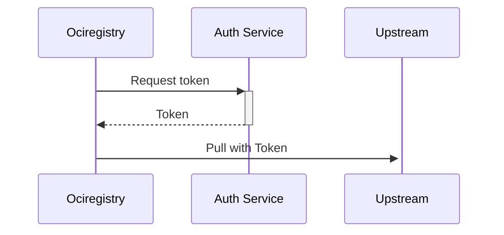

# Authentication

By default, _Ociregistry_ authenticates with the upstream registry if required using the built-in auth mechanisms of the OCI distribution spec implemented by the upstream server itself.

External authentication is also supported. _External authentication_ means obtaining an auth token from an external endpoint, and then using the auth token to pull from the upstream.

## How it works

When you configure a registry for external auth, _Ociregistry_ obtains an auth token from that external auth mechanism and uses that token to pull from the upstream:



Auth config is part of the `registry` configuration element in the `config.yaml` provided to _Ociregistry_ on the command line: `ociregistry --config-file somefile.yaml serve`. The registry configuration looks as follows. The `token` key introduces external auth:
```yaml
registries:
  - name: my-registry.io
    auth:
      token:
        provider: <provider name>
        providerOpts: <comma-separated key=value provider-specific opts>
        expiry: <expiration duration>
        static: <literal token value>
```

The `token` structure is detailed below:

|Field|Description|
|-|-|
|`provider`|Currently, **`ecr`** is the only supported provider. See the next section for details on ECR support.|
|`providerOpts` {: .nowrap-column }|These are provider-specific comma-separated key/value pairs. E.g.: `foo=bar,bin=baz`.|
|`expiry`|This is the token expiration period. The Ociregistry will run a background goroutine to refresh the token every `expiry` period of time. Valid time units are `s` (seconds), `m` (minutes), and `h` (hours). E.g.: `1h`. These values are supported by the Go duration parser. You are free to specify a shorter value than the actual token expiration, for example to ensure that you never have an expired token. |
|`static`|This was introduced for testing but remains as a fall-back. If you obtain a token, you can paste it in here, start the server, and the server will use this rather than running a goroutine to refresh the token periodically.|


## Amazon Elastic Container Registry (ECR)

ECR token-based auth gets a token the same way as this AWS CLI command:
```shell
aws ecr get-authorization-token --output text\
  --query 'authorizationData[].authorizationToken'
```

_Ociregistry_ uses the AWS SDK to obtain the token. The SDK obtains its IAM identity and entitlements from the AWS configuration of the host (EC2 instance, Kubernetes pod, laptop, bare metal server, etc.) Fundamentally _Ociregistry_ doesn't know how the AWS SDK obtains the token. It is the responsibility of the registry installer, or DevOps team to configure the processor that runs _Ociregistry_ to have an identity and entitlement to get a token. From the _Ociregistry_ server's perspective, all those concerns are opaque. Clearly though the requirement is for _Ociregistry_ to be running on a host with an AWS account context.

As long as `aws sts get-caller-identity` returns something meaningful on the processor that is running the _Ociregistry_ server, then the ECR integration should work.

The following provider opts are currently supported:

|Option|Description|
|-|-|
|`profile`|A profile name in `~/.aws/credentials`.|
|`region`|An AWS region. E.g. `us-south-1`.|

Here is a sample `registry` configuration entry for ECR integration:

```yaml
registries:
  - name: 111122223333.dkr.ecr.us-south-1.amazonaws.com
    auth:
      token:
        provider: ecr
        providerOpts: profile=default,region=us-south-1
        expiry: 6h
```

The provider opts are probably redundant in the example above. The goal is to express what is allowed.
