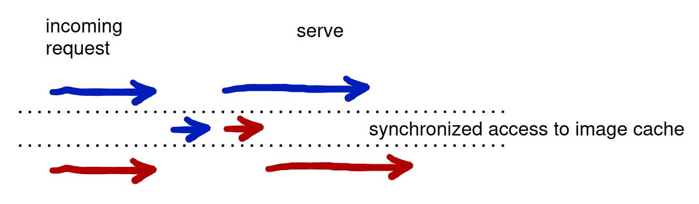
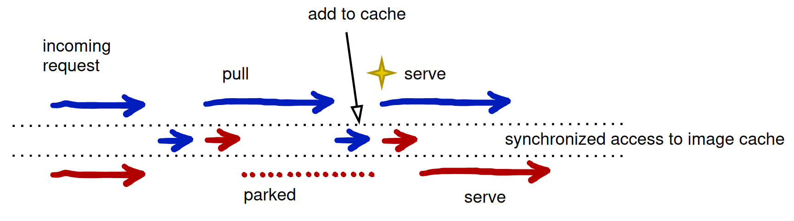

# Concurrency Design

The server maintains an in-memory cache of all manifests on the file system. Access to the manifest cache is synchronized via the in-memory replica because each pull updates the manifest pull date/time both on the file system and in memory. This supports the ability to prune the cache by pull recency.

## Image in cache

In the simple case, where a manifest is in cache, if two clients pull concurrently, the goroutines serving the clients are briefly synchronized to get the manifest from cache and update the pull timestamp. Each goroutine then exits the synchronization block and runs concurrently to serve the image. In the diagram, there is a blue goroutine and a red goroutine running concurrently. In the illustration, the blue goroutine was first into the synchronization block. (Time elapses in the rightward direction.)

## Image not in cache

If the image is not in cache, it is a bit more complex. The complexity is introduced by the design goal to make efficient use of the network. So rather than having multiple concurrent pulls from the upstream, if multiple goroutines simultaneously request _the same image_ that is not in cache, only one goroutine will actually perform the pull, and _all other_ (concurrent) goroutines will wait for that image.

Here is how that looks:

1. As in the previous example, both goroutines are run concurrently by a client such as containerd. As before, each goroutine is sychronized when querying the image cache. But in this example, the image is not in cache.
2. The blue goroutine was first so when it exits the synchronization block it initiates a pull from the upstream.
3. The red goroutine was second to pull the non-existing image so when it exits the synchronization block it is parked, waiting for the blue goroutine to finish pulling the image. So the amount of time for two (or ten, or more) clients to concurrently request an image that needs to be pulled is about the same. The difference is - only the pulling goroutine will actually go to the upstream and utilize the network.
4. When the blue goroutine finishes the pull, it adds the image to the cache, which is synchronized. When it exits the synchronization block it signals the red goroutine - signified by the star in the diagram. (All goroutines waiting for this particular image will be signaled.) This un-parks the red goroutine and then the blue goroutine continues on to serve the image asynchronously.
5. The red goroutine accesses the image from the cache, sychronized.
6. The red goroutine exits the synchronization block and serves the image asynchronously.

Pull synchronization (from upstreams) is by image tag, and is separate from the synchronization for images in cache. In other words, ten clients pulling hello-world:**v3** because it is un-cached and ten other clients pulling hello-world:**v2** that is un-cached and ten other clients accessing hello-world:**v1** from cache are three disjoint synchronization constructs that don't effect each other.

## Blobs

The concurrency design for blobs is a little different. The reason is that there is no need to update pull timestamps on blobs to support image pruning since blobs are children of image manifests. When a manifest is pruned the manifest blobs can simply be pruned by reference. Whereas a manifest is updated each time it is pulled, a blob is never updated. Therefore blobs are synchronized with a Go [RWMutex](https://pkg.go.dev/sync#RWMutex).

This enables many concurrent pulls but supports the infrequent addition of blobs resulting from new image pulls, and the removal of blobs as a result of image pruning. When blobs are added because of new pulls, or removed because of pruning, this will temporarily lock the blob cache. The server offers optimization methods for this. For example, when configuring background pruning, you can configure _Ociregistry_ to prune small sets with greater frequency.

For blobs, only the digest is cached in memory. This is used to efficiently determine if the blob is cached. The blob itself is served from the file system.
