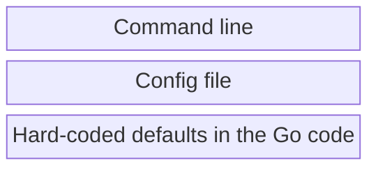

# Configuring The Server

The server will accept configuration on the command line, or via a configuration yaml file. Most of the configuration file settings map directly to the command line. The exceptions are the `pruneConfig`, `registries`, and `serverTlsConfig` entries which are only accepted in the configuration file at this time, being too complex to easily represent as command line args.

As one would expect the following values provide configuration with the lowest priority on the bottom and the highest priority on the top:



To provide full configuration in a file, run the server this way:

```shell
bin/ociregistry --config-file <some file> serve
```

But this is also valid:

```shell
bin/ociregistry --config-file <some file> serve --port 9999
```


## Defaults

The yaml document below shows a `config.yaml` file specifying the defaults that are implemented in the Go code. In other words, running the server with this exact configuration file is the same as running with no configuration file:

```yaml
imagePath: /var/lib/ociregistry
logLevel: error
logFile:
preloadImages:
imageFile:
port: 8080
#os: omit to use the server OS
#arch: omit to use the server architecture
pullTimeout: 60000
alwaysPullLatest: false
airGapped: false
helloWorld: false
health:
registries: []
pruneConfig:
  enabled: false
serverTlsConfig: {}
```

## Config file keys and values

| Key | Type | Default | Command line arg | Description |
|-|-|-|-|-|
|`imagePath` | Path spec | /var/lib/ociregistry | `--image-path` | The base path for the image cache. The server will create sub-directories under this for blobs and manifests. |
|`logLevel` | keyword | error | `--log-level` | Error level logging. See help for valid values. |
|`logFile` | Path spec | - | `--log-file` | Empty means log to stderr. If you specify a file, the logging is directed to the file. |
|`preloadImages` | Path spec | - | `--preload-images` | If the `serve` subcommand is specified, then this is the file containing a list of images to pre-load before starting the server. |
|`imageFile` | Path spec | - | `--image-file` | If the `load` subcommand is specified, then this is the file containing a list of images to load. |
|`port` | Integer | 8080 | `--port` | The port to serve on |
|`os` | keyword | runtime.GOOS | `--os` | If loading or preloading, the OS and arch. If empty, then defaults to the host running the server. So usually comment these out. |
|`arch` | keyword | runtime.GOARCH | `--arch` | " |
|`pullTimeout` | Integer | 60000 | `--pull-timeout` | Number of milliseconds before a pull from an upstream will time out. |
|`alwaysPullLatest` | Boolean | false | `--always-pull-latest` | If true, then whenever a latest tag is pulled, the server will always pull from the upstream - in other words it acts like a basic proxy. Useful when supporting dev environments where latest is frequently changing. |
|`airGapped` | Boolean | false | `--air-gapped` | If true, will not attempt to pull from an upstream when an image is requested that is not cached. |
|`helloWorld` | Boolean | false | `--hello-world` | For testing. Only serves 'docker.io/hello-world:latest' from embedded blobs and manifests |
|`health` | Integer | - | `--health` | A port number to run a /health endpoint on for Kubernetes liveness and readiness. By default, the server doesn't listen on a health port. The Helm chart enables this by default when running the server as a cluster workload. |
|`registries` | List of dictionary | `[]` | n/a | Upstream registries configuration. See further down for registry configuration. |
|`pruneConfig` | Dictionary | see below | n/a | Prune configuration. Pruning is disabled by default. See further down for prune configuration. |
|`serverTlsConfig` | Dictionary | `{}` | n/a | Configures TLS with downstream (client) pullers, e.g. containerd. By default, serves over HTTP. See server tls configuration further down. |

## Registry Configuration

The OCI Distribution server may need configuration to connect to upstream registries. If run with no configuration for a given registry, the server will default to anonymous insecure `HTTPS` access. You specify registry configuration using the `registries` list:

```yaml
registries:
- name: upstream one
  description: foo
  scheme: https
  auth: {}
  tls: {}
- name: upstream two
  description: bar
  scheme: http
  auth: {}
  tls: {}
- etc...
```

Each entry supports the following configuration structure overall. Not all values are required. More detail is presented on that below. This shows the full structure:

```yaml
- name: my-upstream # or my-upstream:PORT, e.g. index.docker.io
  description: Something that makes sense to you (or omit it - it is optional)
  scheme: https # (the default), also accepts http
  auth:
    user: theuser
    password: thepass
  tls:
    ca: /my/ca.crt
    cert: /my/client.cert
    key: /my/client.key
    insecureSkipVerify: true/false # defaults to false
```

Since `scheme` defaults to `https` you can omit that entirely. The `tls` key is optional. If omitted and `scheme` is https then the _Ociregistry_ server attempts insecure 1-way TLS. The default for `tls.insecureSkipVerify` is `false` if omitted (and `tls` is specified.) Similarly, `description` is ignored by the server and can be omitted.

The `auth` section implements basic auth, just like your `~/.docker/config.json` file.

The `name` value is the upstream host name that you will pull from. For example say you're running the server on your desktop in test mode on `localhost:8080`. Let's also say that you have an in-house corporate registry that serves proprietary images on `my-corp-registry.myco.org:8888`. You run this command to pull **through** the _Ociregistry_ server **from** your corporate registry server this way:
```shell
docker pull localhost:8080/my-corp-registry.myco.org:8888/my-proprietary-app:v1.0.0
```
Say your corp registry server requires user and password. Then you would configure a `registries` entry in the _Ociregistry_ server config file like this:
```yaml
- name: my-corp-registry.myco.org:8888
  auth:
    user: theuser
    password: thepass
```

Here's another scenario. Let's say your corp DNS resolves `index.docker.io` to an in-house registry mirror that requires an NPE cert. Then your registry entry might look like:
```yaml
- name: index.docker.io
  tls:
    cert: npe.crt
    key: npe.key
```

The `tls` section can implement multiple scenarios:

1. One-way **insecure** TLS, in which client certs are not provided to the remote, and the remote server cert is not validated:
   ```yaml
   tls:
     insecureSkipVerify: true
   ```
2. One-way **secure** TLS, in which client certs are not provided to the remote, and the remote server cert **is** validated using the OS trust store:
   ```yaml
   tls:
     insecureSkipVerify: false # (or omit, since it defaults to false)
   ```
3. One-way **secure** TLS, in which client certs are not provided to the remote, and the remote server cert is validate using a **provided** CA cert:
   ```yaml
   tls:
     ca: /my/ca.crt
   ```
4. mTLS (client certs are provided to the remote):
   ```yaml
   tls:
     cert: /my/client.cert
     key: /my/client.key
   ```
   mTLS can be implemented **with** and **without** remote server cert validation as described above in the various one-way TLS scenarios. Examples:
   ```yaml
   - name: foo.bar.1.io
     description: mTLS, don't verify server cert
     tls:
       cert: /my/client.cert
       key: /my/client.key
       insecureSkipVerify: true
   - name: foo.bar.2.io
     description: mTLS, verify server cert from OS trust store
     tls:
       cert: /my/client.cert
       key: /my/client.key
       insecureSkipVerify: false
   - name: foo.bar.3.io
     description: mTLS, verify server cert from provided CA
     tls:
       cert: /my/client.cert
       key: /my/client.key
       ca: /remote/ca.crt
       insecureSkipVerify: false
   ```

## Server TLS configuration

By default, the server serves over HTTP. The `serverTlsConfig` section in the config file configures the _Ociregistry_ server to serve over TLS. 

The `cert`, `key`, and `ca` are expected to be PEM encoded files. Example:

```yaml
serverTlsConfig:
  cert: /path/to/pem/encoded/server.crt
  key: /path/to/pem/encoded/server.private.key
  ca: /path/to/pem/encoded/ca.crt
  clientAuth: none # or verify
```

## Server TLS permutations

The following permutations are supported or serving over HTTPS:

| Configuration | Description |
|-|-|
| `cert` and `key` populated | The server will provide the cert to the client to establish 1-way TLS. |
| `clientAuth: none` | Client cert is not requested and will be ignored if provided. |
| `clientAuth: verify` | mTLS: Client cert is required and verified. See the `ca` key below. |
| `ca` populated | Client cert is validated against the provided CA. |
| `ca` omitted | Client cert is validated against the OS trust store. |


## Prune Configuration

Pruning configures the server to remove images as a background process based on create date or recency of a pull. (Each time an image is pulled the server updates the pull date/time for the image.) Pruning is disabled by default. An example full prune configuration is as follows:

```yaml
pruneConfig:
  enabled: true
  duration: 30d
  type: accessed
  frequency: 1d
  count: -1
  dryRun: false
```

## Prune configuration keys and values

| Key | Type | Description |
|-|-|-|
| `enabled` | Boolean | If true, enables background pruning. |
| `duration` | Duration expression | E.g.: `30d`. The value is interpreted based on the prune `type` below. Valid time units are `ns` (nanoseconds), `us` or `µs` (microseconds), `ms` (milliseconds), `s` (seconds), `m` (minutes), `h` (hours), and `d` (days). |
| `type` | Keyword | Valid values are `accessed` and `created`. If `accessed`, then the server prunes images that have not been pulled in `duration` amount of time. If `created`, then the server prunes images whose create date is older than `duration` time ago. |
| `frequency`| Duration expression | E.g.: `1d`. Run the background pruner with this frequency. The time units are the same as for `duration`. |
| `count` | Integer | The number of images to prune on each run of the background pruner. A value of `-1` means no limit to the number of images pruned. |
| `dryRun` | Boolean | If `true` then just log messages but don't actually prune. For testing and troubleshooting. |

> Since pruning locks the cache, a good strategy is to limit the number of pruned images on each invocation of the pruner and run with greater frequency.
