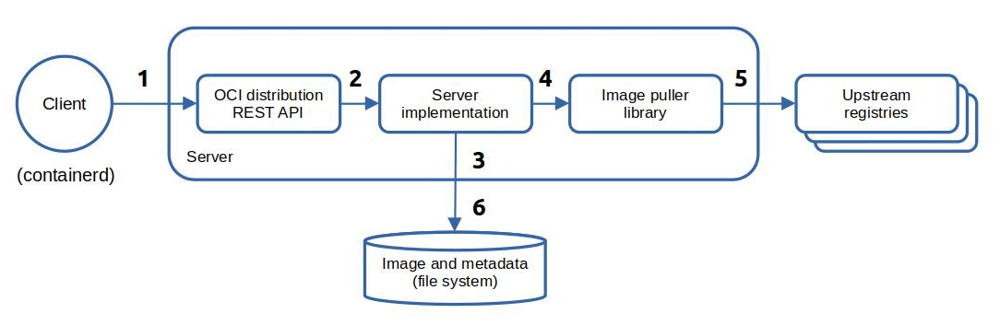
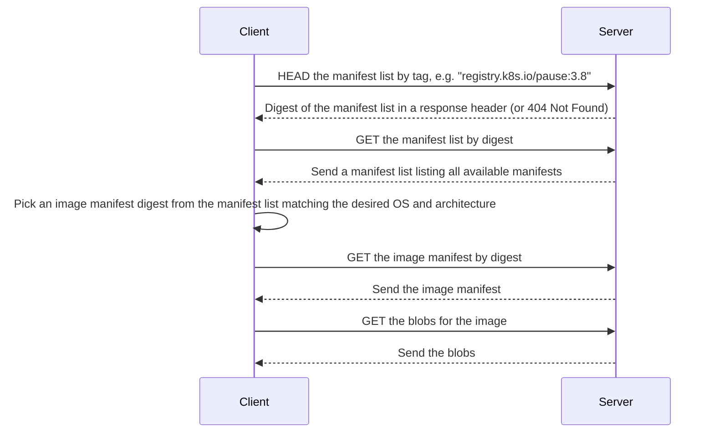

# Design

This is the design of the _Ociregistry_ server:



Narrative:

1. A client (in this case - `containerd`) initiates an image pull. The image pull consists of a series of REST API calls. The API calls are handled by the server's implementation of a subset of the [OCI Distribution Spec](https://github.com/opencontainers/distribution-spec).
1. The API is just a veneer that delegates to the server implementation.
1. The server checks the local cache and if the image is in cache it is immediately returned from cache.
1. If the image is not in cache, the server calls the embedded [ImgPull](https://github.com/aceeric/imgpull) library to pull the image from the upstream registry. The server knows which upstream to pull from because `containerd` appends a query parameter (e.g. `?ns=registry.k8s.io`) to each API call.
   > The server also supports in-path upstreams, e.g.: `docker pull ociregistry.host/registry.k8s.io/pause:3.8`
1. The embedded image puller library pulls the image from the upstream registry and returns it to the server.
1. The server adds the image to cache and returns the image to the caller from the newly updated cache.

## Image Pull Sequence Diagram

By way of background, a typical image pull sequence is as follows. If you tail the logs of the _Ociregistry_ server, this is what you'll see:



To support this, the server caches both the image list manifest and the image manifest.

## Code Structure

The source code is organized as shown:

```text
project root
├── api
├── bin
├── charts
├── cmd
├── docs
├── impl
│   ├── cache
│   ├── cmdline
│   ├── config
│   ├── globals
│   ├── helpers
│   ├── metrics
│   ├── preload
│   ├── pullrequest
│   ├── serialize
│   ├── handlers.go
│   └── ociregistry.go
└── mock
```

| Package | Description |
|-|-|
| `api`  | Mostly generated by `oapi-codegen` using the OAPI Spec `ociregistry.yaml` in that directory. |
| `bin`  | Has the compiled server after `make server`. |
| `charts`  | The Helm chart. |
| `cmd`  | Entry point (`ociregistry.go`) and sub-commands. |
| `docs`  | [MKDocs](https://www.mkdocs.org/) documentation ([Material](https://github.com/squidfunk/mkdocs-material) theme.) |
| `impl` | Has the implementation of the server. |
| `impl/cache` | Implements the in-memory cache. |
| `impl/cmdline` | Parses the command line. |
| `impl/config` | Has system configuration. |
| `impl/globals` | Globals. |
| `impl/helpers` | Helpers. |
| `impl/metrics` | The Observability implementation. |
| `impl/preload` | Implements the load and pre-load from an image list file. |
| `impl/pullrequest` | Abstracts the URL parts of an image pull. |
| `impl/serialize` | Reads/writes from/to the file system. |
| `impl/handlers.go` | Has the code for the subset of the OCI Distribution Server API spec that the server implements. |
| `impl/ociregistry.go` | A veneer that the embedded [Echo](https://echo.labstack.com/) server calls that simply delegates to `impl/handlers.go`. See the next section - _REST API Implementation_ for some details on the REST API. |
| `mock` | Runs a mock upstream OCI Distribution server used by the unit tests. |

## REST API Implementation

As stated above, the _Ociregistry_ server implements **a portion** of the OCI Distribution Spec consisting of only the endpoints in the spec needed to meet its goal of being a pull-only OCI Distribution Server. It does this by running an http server that handles REST endpoints defined in the spec.

The _Ociregistry_ server REST API is built by first creating an Open API spec: see [ociregistry.yaml](https://github.com/aceeric/ociregistry/blob/main/api/ociregistry.yaml) in the `api` directory of the project. Then the [oapi-codegen](https://github.com/oapi-codegen/oapi-codegen) tool is used to generate the API code and the Model code using configuration in the `api` directory of the project. This approach was modeled after the OAPI-Codegen [Petstore](https://github.com/oapi-codegen/oapi-codegen/tree/main/examples/petstore-expanded) example.

*Oapi-codegen* is installed by the following command:

```shell
go install github.com/oapi-codegen/oapi-codegen/v2/cmd/oapi-codegen@latest
```

The key components of the API scaffolding supported by OAPI-Codegen are shown below:

```
├── api
│   ├── models
│   │   └──models.gen.go   (generated)
│   ├── models.cfg.yaml    (modeled from pet store)
│   ├── ociregistry.gen.go (generated)
│   └── server.cfg.yaml    (modeled from pet store)
├── cmd
│   └── ociregistry.go     (this is the server - which embeds the Echo server)
└── ociregistry.yaml       (the openapi spec built with swagger)
```

I elected to use the [Echo](https://echo.labstack.com/) option to run the API. The **Echo** server is started by the [serve](https://github.com/aceeric/ociregistry/blob/main/cmd/subcmd/serve.go) sub-command of the _Ociregistry_ server.
