# Load Testing

The project includes tooling in the [testing/load](https://github.com/aceeric/ociregistry/tree/main/testing/load) directory to conduct two types of load tests. One load test focuses on concurrent pulls from upstreams and the second focuses on concurrent pulls from cache. Both tests use the same tools and test driver.

To test concurrent pulls from upstreams, the test driver pulls through the _Ociregistry_ and then immediately prunes all the pulled images, repeating this in a loop. To test concurrent cached pulls the process is the same, omitting the pruning step.

## Physical Topology

The following diagram shows the physical processors used in the tests documented in this section:


1. The test driver is a Ubuntu laptop with 32 gigs of memory and Intel Core i7-8700SH x16 processors. It runs the test driver CLI.
2. The server is a Ubuntu workstation with 64 gigs of memory and Intel Core i7-8700 x12 processors. It runs the _Ociregistry_ server as a stand-alone executable, and Docker [Registry](https://hub.docker.com/_/registry) in a container run by Docker daemon (containerd.)
3. Both test driver and server machines are on the same network segment.

## Software Components

The following project components implement load testing:

{ width="100%" }

> Some of the shell scripts shown use a tool called [imgpull](https://github.com/aceeric/imgpull) which is both a CLI and a library. It's the component that the _Ociregistry_ embeds as a package to pull from upstreams.

### Prepare

1. The `observability` directory has a shell script `start-containers` that starts Prometheus and Grafana in containers, mounting all the configuration files needed to monitor _Ociregistry_ metrics using the provided dashboards.
2. The `testing/load` directory has the following shell scripts:
    1. The `maketar` script generates many image tarballs with randomized image references like `zhymakpdjr-wt379wo54x-0001:v883.998`. The first part (`zhymakpdjr-wt379wo54x`) and the tag (`:v883.998`) promote uniqueness across the entire test set to be able to generate a large volume of images without name collisions. The middle part (`-0001`) is to enable batching. Batching enables the test driver to task one goroutine with pulling images matching `-0001`, the second goroutine pulling `-0002`, and so on. More on batching below.
    2. The `load-docker-container` script starts the Docker Registry in a container, loads image tarballs into the Docker cache, tags them, and then pushes them to the Docker Registry running in the container. At this point, the test is ready to run.

### Execute

1. The `testing/load/driver` directory actually runs the tests. See the [Test Driver](test-driver.md) section details.
2. When the test driver starts, it first queries the Registry container for all images (that were loaded by the `load-docker-container` script.)
3. The test driver then pulls from _Ociregistry_ and records the pull rate for the duration of the test.
2. And of course the _Ociregistry_ server under test is run on the server, to pull through on `:8080`, and exposing metrics on `:2112/metrics`. Both ports are configurable. The `/metrics` path is not.

## Test Driver

The test driver scales up - and then down - a number of goroutines to pull from the _Ociregistry_ server concurrently and records the client-side **image** pull rate. This includes pulling the image and blobs and creating a tarball. (There's some overhead here, granted.) The observability stack records server behavior during the test, and then the results are evaluated. The test driver records the client's area of concern: _how many **images** can be pulled per second?_ Fundamentally, this is what `containerd` will care about.

{ width="100%" }

### Patterns and Batching

When testing pull-**through**, the test driver supports running each goroutine with an exclusive set of images using a pattern. The idea of patterns is to chunk the image list into disjoint sets and thereby force a high level of concurrency for pull-through. To elaborate further: if 100 clients were to pull exactly the same image at exactly the same instant from _Ociregistry_, then only one client will actually pull and the other 99 will be parked by the server and then pull from cache when the first client finishes pulling from the upstream and adds the image to cache.

Because of this design, having many clients pull the same exact image concurrently doesn't really test pull-through concurrency. (It does test cached pull concurrency.) Having many clients pull disjoint images concurrently actually tests pull-through concurrency (and load.)

To support this the test driver supports two modes. If the `--prune` arg is specified then each goroutine will prune the images it pulled on each pass. On the next pass through for that goroutine, the _Ociregistry_ will have to re-pull from the upstream again.  If the `--prune` arg is **not** specified then each goroutine will simply be pulling from cache which will measure a different behavior in the server.

Note that since pruning itself introduces locking and load on the server it distorts the pull-through test somewhat but there's no other way to test a large volume of concurrent pulls without loading the upstream with a significant number of images.

## Test Preparation

The preparation steps are:

1. Run the `maketar` script to generate a set of images. These are small images that test concurrency. Each image has five small blobs. So this isn't about testing large blob pulls, network latency, etc. It's purely a concurrency test. The `maketar` script has logic to generate a defined number of batches. For example: 1000 images in batches of 100 with the batching pattern in the image ref like `-0001`, `-0002` and so on.
2. Start the Docker Registry container on port 5000.
3. Run the `load-docker-container` script to move the image tarballs into the Docker Registry container.
4. Start _Ociregistry_ server on port 8080, exposing metrics on port 2112, on the `/metrics` path.
5. Start Prometheus and Grafana.

## Test Execution

1. Start the test driver with args that support the batching strategy employed when the `maketar` script was run.
    1. To test pull **through**, specify the `--prune` arg.
    2. To test **cached** pulls, omit the `--prune` arg.

    Example (cached pull test):
    ```
    go run .\
      --pullthrough-url=ubuntu.me:8888\
      --registry-url=ubuntu.me:5000\
      --patterns=-0001,-0002,-0003\
      --iteration-seconds=30\
      --tally-seconds=15
    ```

2. The test driver first scales up the goroutines with each goroutine pulling one unique batch (if configured that way).
3. The test driver then scales the goroutines down to zero, which ends the test.
4. The test driver generates pull rate metrics either to a file or to the console depending on command line args.

> I considered capturing test driver metrics with Prometheus. Instead, I thought there might be value in a _second opinion_ on calculating the pull rate - especially from the client's perspective. So the test driver metrics are implemented with Golang packages, namely the [atomic](https://pkg.go.dev/sync/atomic) and [ticker](https://pkg.go.dev/time#Ticker) packages.

## Results

The test results documented below capture a test run with the following parameters:

1. Docker Registry populated with 1,500 images each with 5 small blobs.
2. Ten batches of 150 images each, enabling 10 client puller goroutines to pull disjoint sets.
3. Test driver scales from 1 to 10 puller goroutines and then back down to 1, then stops the test.
4. Test driver runs for 60 seconds between adding / stopping puller goroutines resulting in a 20 minute test.

Each result section below stacks the charts listed in the table below. Since client side metrics were calculated using go (not prometheus) and imported into Excel, the first chart looks different than the Grafana dashboard panels. The reader is directed to the `impl/metrics` package for details on the go runtime metrics.

|Where|Metric|Note|
|-|-|-|
|Client side test driver|Image pulls per second and puller Goroutines|These are full downloads of an image tar to the file system.|
|Ociregistry server|Detailed memory statistics||
|Ociregistry server|Goroutines and go threads||
|Ociregistry server|Heap Bytes||
|Ociregistry server|Heap Objects||
|Ociregistry server|Garbage collection cycles||
|Ociregistry server|Mutex wait|The server synchronizes shared cache access with a mutex.|
|Ociregistry server|Network send/receive bytes||
|Ociregistry server|Topline resident memory||
|Ociregistry server|Manifest pull rate|Usually each image pull will consist of at least one image list manifest pull and one image manifest pull.|
|Ociregistry server|Blob pull rate|The test arbitrarily sets up 5 small blobs per image|
|Ociregistry server|Cached or Upstream pull rate by namespace||
|Ociregistry server|API Error rate||

### Pull-Through Results

The pull-through test pulled through the _Ociregistry_ server to the Docker registry. After each pass through the pull list, the puller goroutine pruned the images it just pulled, forcing the _Ociregistry_ to re-pull them the next time. The prune operation - while  fast - _does_ lock the in-mem cache briefly which certainly impacts performance and therefore taints the test. However, without having the ability to load an upstream registry with literally hundreds of thousands of images, the selected approach was the only feasible way to test pull-through concurrency.

Topline summary: with 10 client goroutines, the client-side pull rate topped out at about 320 images per second. The rate never peaked so its possible that with more goroutines, a higher pull rate could be acheived. Some aspect of latency is attributable to the "upstream" Docker Registry container but that was not specifically isolated.


Test driver: Puller goroutines scaling up from 1 to 10 then back down.
---

Go runtime detailed mem stats. The Green line is memory classes total usage bytes. Yellow (top) is memory classes total bytes (sum of all). The green line is the most relevant
---

Go runtime. Yellow is go threads, green is goroutines.
---

Go runtime. Yellow is heap released bytes, green is heap alloc bytes.
---
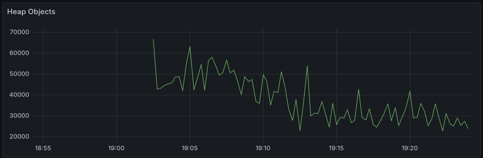
Go runtime heap objects. When the server starts this spikes is associated with loading the in-memory cache on startup.
---
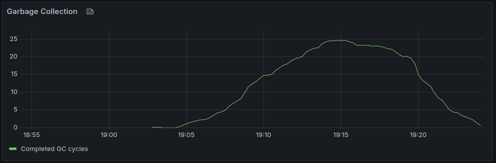
Go runtime garbage collection cycles.
---

Go runtime mutex wait time/sec.
---

Go runtime network bytes. Yellow is send. Green is receive.
---
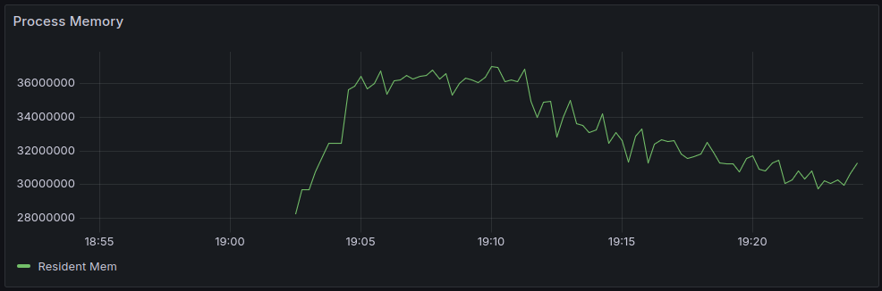
Go runtime process memory.
---

Ociregistry manifest pull rate (includes image list manifests and image manifests.)
---

Ociregistry blob pulls: 5 blobs and a config blob for each image pulled.
---

Ociregistry: cached manifest pull.
---
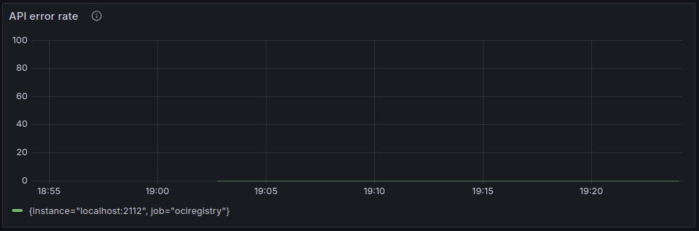
Ociregistry: no API errors.

### Cached Pull Results

The cached pull simply pulls from cache (without pruning.)

Topline summary: with 10 client goroutines, the client-side pull rate topped out at about 1,800 images per second. Interestingly as the pull load hit 10 puller goroutines, the server suffered some performance degradation. I attribute this to the high mutex wait which is a side-effect of the simple concurrency design which forces all pulls through a mutex so that each pull can update the pull date/time stamp to support pruning by pull recency.


Test driver: Puller goroutines scaling up from 1 to 10 then back down.
---
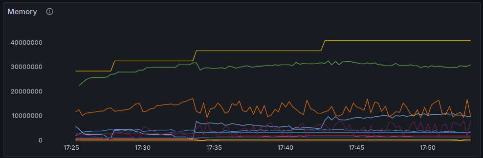
Go runtime detailed mem stats. The Green line is memory classes total usage bytes. Yellow (top) is memory classes total bytes (sum of all). The green line is the most relevant
---
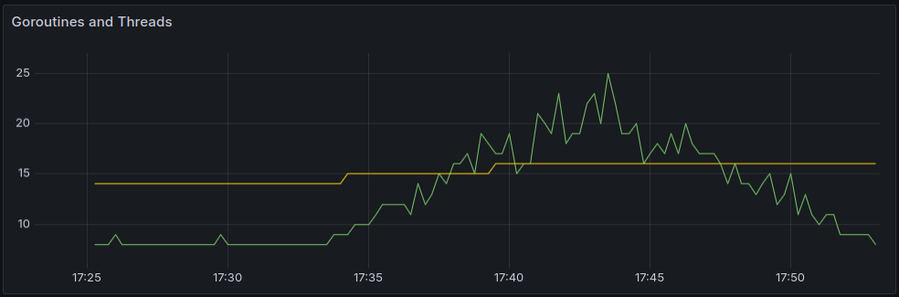
Go runtime. Yellow is go threads, green is goroutines.
---

Go runtime. Yellow is heap released bytes, green is heap alloc bytes.
---

Go runtime heap objects. When the server starts there is a spike in heap objects associated with loading the in-memory cache on startup.
---

Go runtime garbage collection cycles.
---
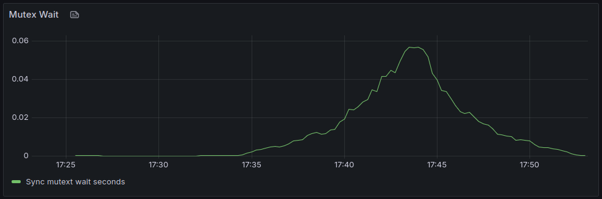
Go runtime mutex wait time/sec.
---
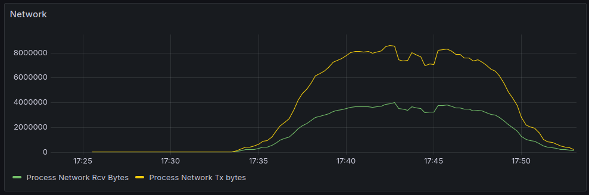
Go runtime network bytes. Yellow is send. Green is receive.
---

Go runtime process memory.
---
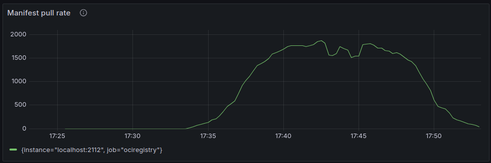
Ociregistry manifest pull rate (includes image list manifests and image manifests.)
---
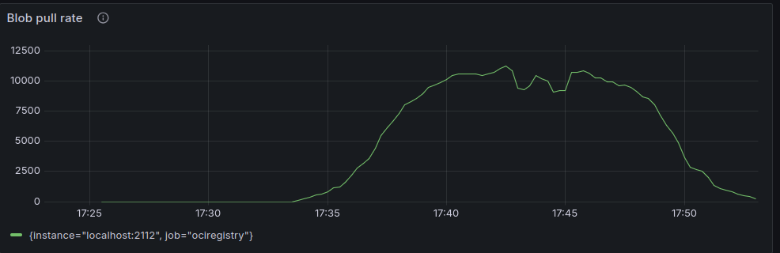
Ociregistry blob pulls: 5 blobs and a config blob for each image pulled.
---
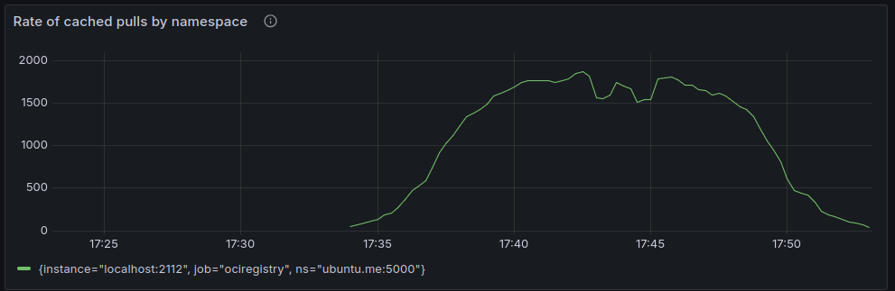
Ociregistry: cached manifest pull.
---
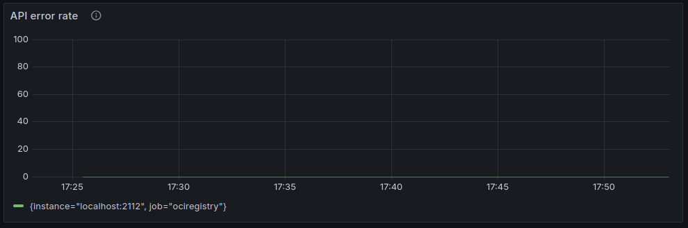
Ociregistry: no API errors.

## Summary

The load test is an artificial effort to max out concurrency. The test set is a 1,500 small images. Pulling any one of these images produces a roughly 9K tarball that can be pulled from cache in 7.5 milliseconds:

```
$ imgpull localhost:8888/ubuntu.me:5000/a3xuzdp7kd-pmwvzztrob-0010:v339.283 deleteme.tar --scheme http
image "localhost:8888/a3xuzdp7kd-pmwvzztrob-0010:v339.283" saved to "deleteme.tar" in 7.487947ms
```

Then:
```
$ ls -l deleteme.tar
-rw-rw-r-- 1 foo foo 9216 Dec  5 21:10 deleteme.tar
```

Given the huge variance in image sizes, network latency, etc. in the real world, I venture to say a real world load test would be hard to devise. But from the current load test, the project draws the small number of conclusions. (It is worth re-stating the design goals of the server: to be simple, reliable, and performant.)

1. The server is reliable. Every image tarball requested by the test driver was returned. The server doesn't appear to leak memory or goroutines.
2. The server is performant in its role as an edge distribution sever. Even with 1,500 manifests in the in-mem cache, the memory footprint (< 40Mb) doesn't seem extreme.
3. The server is reasonably simple in its operational footprint and design. One clear downside of the simple concurrency design is the dip in throughput under the heaviest load. However, it seems unlikely that the server would ever be loaded in the wild as heavily as it was loaded by the test. Therefore, there seems no compelling reason (other than curiosity) for pursuing design optimizations.
