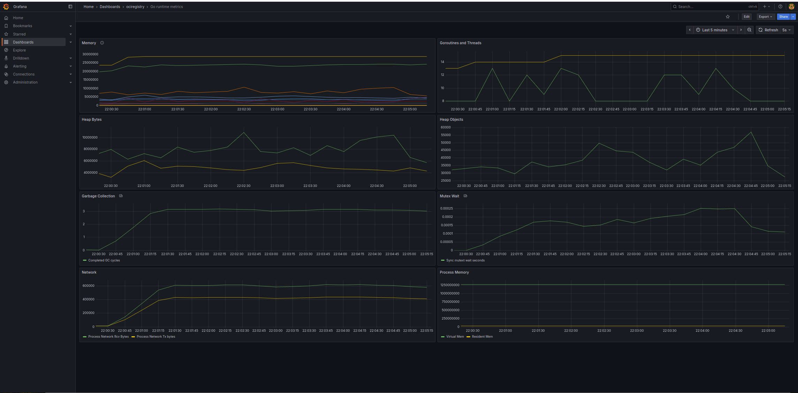

# Observability

The _Ociregistry_ server implements [Prometheus](https://prometheus.io/) metrics exposition. Metrics are implemented in the [metrics](https://github.com/aceeric/ociregistry/tree/main/impl/metrics) package of the server. Two types of Metrics are provided in two [Grafana](https://grafana.com/) dashboards, discussed in the following sections.

## Metrics Dashboards

### Go Runtime Metrics

Go runtime metrics make use of the Go [runtime/metrics](https://pkg.go.dev/runtime/metrics) package. The implementation of Go runtime metrics in the server was informed by the following articles, for which the project expresses appreciation:

1. [Monitor Your Go Process Internal Metrics in Minutes](https://docs.dynatrace.com/docs/ingest-from/technology-support/application-software/go/configuration-and-analysis/analyze-go-metrics) by Gil Adda, CyberArk Engineering
2. [Go memory metrics demystified](https://www.datadoghq.com/blog/go-memory-metrics/) by [Datadog](https://www.datadoghq.com)

The Go runtime metrics package consists of a large set of measurements. All the metrics are exposed to Prometheus, but only the subset that seemed most relevant to the server are presented in the project's Go runtime metrics dashboard.

### _Ociregistry_ Metrics

The _Ociregistry_ metrics are a narrower set than the Go Runtime metrics, reflecting the simple nature of the server:

| Metric | Description |
|-|-|
| Cached Pulls By Namespace | This is a running total of pulls of cached manifests. The dash presents it as a rate. These are bucketed by namespace (e.g. `docker.io`, `quay.io`, and so on. |
| Upstream Pulls By Namespace | This is a running total of manifest pulls from upstream registries. Also presented as a rate, and bucketed. |
| Manifest Pulls Total | Simply the sum of cached and un-cached pulls. |
| Blob Pulls | Like manifest pulls, this is the count of blob pulls. Since most manifests contain many blobs, this is expected to be a larger number than the sum of cached and un-cached pulls. |
| Blob Bytes On Disk | Total blob bytes on the file system. |
| Manifest Bytes On Disk | Total manifest bytes on the file system. |
| Cached Manifest Count | Number of manifests in the in-mem cache. Since most images you pull consist of a multi-arch image list manifest, and an os/arch-specific image, this count will always be greater than the number of manifest files on the file system. The goal here is to understand memory footprint.  |
| Cached Blob Count | Same as cached manifest count. However, since only the blob digest is cached in-mem, and only cached once, this _should_ match the file system blob count. |
| V2 Api Endpoint Hits | Total hits against the V2 OCI Distribution Server spec endpoints _that are implemented by the server_. |
| Api Errors | This is the count of ant API call that results in an error. For example, if one client undertakes an image pull and starts requesting the blobs for an image, and another client simultaneously prunes that image and blobs, then the first client may request a blob that is no longer cached. This is handled as an error by the server. |

##  How to use

Metrics are disabled in the server by default, and can be enabled for the `serve` sub-command with either the `--metrics` command-line arg, or the `metrics:` key in the config file. E.g.: `ociregistry serve --metrics 2112`.

Or: `ociregistry --config-file mycfg.yaml serve`, if `mycfg.yaml` has:
```
metrics: 2112
```

Metrics can be exposed on any port, but take note that the [observability](https://github.com/aceeric/ociregistry/tree/main/observability) directory of the project has `2112` hard-coded into the Prometheus scrape configuration so be aware of that when starting the metrics observability components discussed in the next section.

## Observability Components

As discussed above, the **observability** directory of the project has the items needed to access the metrics. The main entry point there is the [`start-containers`](https://github.com/aceeric/ociregistry/blob/main/observability/start-containers) Bash script.

This script starts Prometheus, scraping on port 2112 on localhost and then starts Grafana, pulling from Prometheus on localhost:9090. At the present moment, the metrics are only available when running the _Ociregistry_ server locally. Primarily they support load testing.

## Dashboards

### Go Runtime Metrics dashboard



From top left to right, and then down, the dashboard shows:

| Row | Left Panel | Right Panel |
|-|-|-|
| 1 | Memory | Goroutines and threads |
| 2 | Heap bytes | Heap objects |
| 3 | Garbage collection | Mutex wait |
| 4 | GC cycles | Process memory |

> Process memory is distorted by Virtual Mem which may be coming out of the panel after further evaluation.

### _Ociregistry_ Metrics dashboard


From top left to right, and then down, the dashboard shows:

| Row | Left Panel | Right Panel |
|-|-|-|
| 1 | Manifest pulls | Blob pulls |
| 2 | Cached pulls  | Upstream (un-cached) pulls |
| 3 | File system blob and manifest bytes | Cached manifest and blob counts |
| 4 | Total endpoint hits | API errors |

There are a couple of things to be aware of regarding manifest statistics:

1. The dashboard counts manifests in the in-memory cache. Most images cached by the server consist of two manifests: a multi-platform _image list_ manifest and an OS+architecture _image manifest_. Further, when a manifest is cached in memory by tag, it is stored twice: once by tag and once by digest. Because of this the count of cached manifests - being a memory count - will always be higher than the number of manifest files on the file system. The thing to remember is that the dashboard metrics are memory object counters.
2. The manifest pull rate also reflects the fact that a typical client image pull consists of first an image list manifest pull (by tag), then an image manifest pull (by digest.) Therefore, the stats you see in the dashboard will almost always be higher a client-centric count of image pulls.

## Summary

In summary, to access the metrics:

1. `ociregistry serve --metrics 2112`.
2. `observability/start-containers`.
3. Open Grafana in your browser on http://localhost:3000. (You might have to disable Tracking Protection in Firefox or other browser equivalent.)
4. Log in with the user/pass in the shell script.
5. The _Ociregistry_ dashboards are in the `Ociregistry` folder under `Dashboards` in the Grafana UI left panel.
